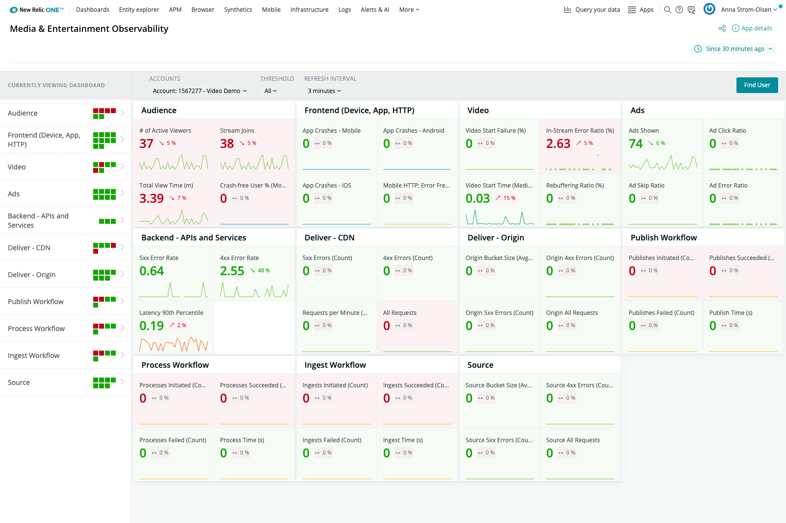

[](https://opensource.newrelic.com/oss-category/#archived)

# Media and Entertainment Observability (MandE)

Understand the health of your end-to-end Video Streaming workflow, and troubleshoot issues in specific user video sessions.

# Usage

Before starting to use the app, make sure you have the necessary video agents deployed to your web sites and mobile apps.

## Screenshot



## Getting started

1. Ensure that you have [Git](https://git-scm.com/book/en/v2/Getting-Started-Installing-Git) and [NPM](https://www.npmjs.com/get-npm) installed. If you're unsure whether you have one or both of them installed, run the following command. (If you have them installed these commands will return a version number, if not, the commands won't be recognized.)

   ```bash
   git --version
   npm -v
   ```

2. Install the [New Relic One CLI](https://one.newrelic.com/launcher/developer-center.launcher) by going to [this link](https://one.newrelic.com/launcher/developer-center.launcher) and following the instructions (5 minutes or less) to install and set up your New Relic development environment.

3. Run the following command to clone this repository and run the code locally against your New Relic data:

   ```bash
   nr1 nerdpack:clone -r https://github.com/newrelic-experimental/nr1-mande.git
   cd nr1-mande
   nr1 nerdpack:serve
   ```

Visit [https://one.newrelic.com/?nerdpacks=local](https://one.newrelic.com/?nerdpacks=local), navigate to the Nerdpack, and :sparkles:

## Deploying this Nerdpack

Open a command prompt in the Nerdpack's directory,and run the following commands.

```bash
# To create a new uuid for the nerdpack so that you can deploy it to your account:
# nr1 nerdpack:uuid -g [--profile=your_profile_name]

# To see a list of APIkeys / profiles available in your development environment:
# nr1 profiles:list

nr1 nerdpack:publish [--profile=your_profile_name]
nr1 nerdpack:deploy [-c [DEV|BETA|STABLE]] [--profile=your_profile_name]
nr1 nerdpack:subscribe [-c [DEV|BETA|STABLE]] [--profile=your_profile_name]
```

## Support

New Relic hosts and moderates an online forum where customers can interact with New Relic employees as well as other customers to get help and share best practices. Like all official New Relic open source projects, there's a related Community topic in the New Relic Explorers Hub.

## Contributing

We encourage your contributions to improve [Open Boards]! Keep in mind when you submit your pull request, you'll need to sign the CLA via the click-through using CLA-Assistant. You only have to sign the CLA one time per project.
If you have any questions, or to execute our corporate CLA, required if your contribution is on behalf of a company, please drop us an email at opensource@newrelic.com.

## License

[Video Observability] is licensed under the [Apache 2.0](http://apache.org/licenses/LICENSE-2.0.txt) License.
